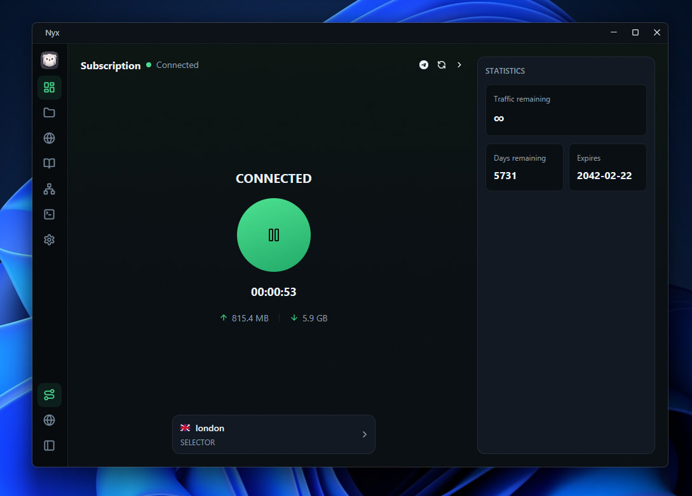

<div align="center">


# Nyx

A modern, lightweight desktop GUI for the [Mihomo](https://github.com/MetaCubeX/mihomo) proxy core. Manage profiles, proxy groups, rules and connections from a clean interface — with system proxy and TUN mode, connection inspector with per-process grouping and app icons, built-in profile editor, auto-updater and a polished UX.

[](https://discord.gg/qNyybSSPm5)
[](https://github.com/BX-Team/Nyx)

</div>

# Preview



# Installation

Grab the latest build from the [Releases page](https://github.com/BX-Team/Nyx/releases/latest).

## Windows

- **x64:** `Nyx_<version>_x64-setup.exe`
- **ARM64:** `Nyx_<version>_arm64-setup.exe`

Run the NSIS installer and follow the prompts. On first launch Nyx will ask for elevation to install the helper service required for TUN mode — accept it once and you are set.

## Linux

- **x86_64:** `Nyx_<version>_amd64.AppImage`

```bash
chmod +x Nyx_*_amd64.AppImage
./Nyx_*_amd64.AppImage
```

## Build from source

Requirements: [Rust](https://www.rust-lang.org/tools/install) (stable), [Bun](https://bun.sh/), and the Tauri platform prerequisites ([guide](https://tauri.app/start/prerequisites/)).

```bash
git clone https://github.com/BX-Team/Nyx.git
cd Nyx
bun install
bun run tauri:dev     # run in development
bun run tauri:build   # produce a release bundle
```


# License

This project is licensed under the GPL-3.0 License - see the [LICENSE](LICENSE) file for details.

# Contributing

We welcome contributions to Nyx! If you have an idea for a new feature or found a bug, please feel free to submit a pull request. Before you start, please read our [contributing guidelines](CONTRIBUTING.md) to understand our contribution process.

# Credits

Nyx was based on or inspired by these projects:

- [coolcoala/koala-clash](https://github.com/coolcoala/koala-clash): GUI client for Mihomo. Nyx interface is based on Koala Clash interface.
- [MetaCubeX/mihomo](https://github.com/MetaCubeX/mihomo): A rule-based tunnel in Go.
- [DINGDANGMAOUP/mihomo-rs](https://github.com/DINGDANGMAOUP/mihomo-rs): A Rust SDK for Mihomo, manages versions, configs and other things.
- [vitejs/vite](https://github.com/vitejs/vite): A frontend build tool.
